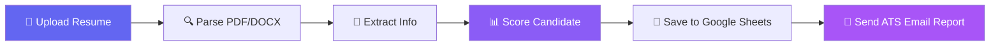

<div align="center">

# 🤖 AI Resume Scoring Agent

### Intelligent ATS Resume Analysis & HR Automation System

[](https://insightful-gentleness-production-f660.up.railway.app/)
[](https://python.org)
[](https://fastapi.tiangolo.com)
[](https://railway.app)
[](LICENSE)

<br/>

**An Agentic AI-powered HR Automation System that parses resumes, scores candidates against job requirements, and sends detailed ATS analysis reports via email — all in real-time.**

<br/>

[**🚀 Try Live Demo**](https://insightful-gentleness-production-f660.up.railway.app/) · [**📖 Documentation**](#-how-it-works) · [**🐛 Report Bug**](https://github.com/mudavathsanthosh610/AI-Resume-Scoring-Agent/issues) · [**💡 Request Feature**](https://github.com/mudavathsanthosh610/AI-Resume-Scoring-Agent/issues)

</div>

---

## 🌟 Highlights

<table>
<tr>
<td width="50%">

### 🎯 Smart Resume Scoring
Upload a PDF/DOCX resume and get an **instant ATS score out of 100** with a detailed breakdown across 7 categories — education, experience, skills, location, college tier, resume quality, and profile headline.

</td>
<td width="50%">

### 📧 Automated Email Reports
Every candidate receives a **beautifully formatted ATS analysis email** with score breakdown, skill gap analysis, personalized improvement tips, and quick action items — all automatically.

</td>
</tr>
<tr>
<td width="50%">

### 🏢 Multi-Job Pipeline
Manage **10+ job postings** from a Google Sheet. Each job has its own required skills, preferred location, minimum experience, and selection threshold — fully configurable without code changes.

</td>
<td width="50%">

### 📊 Google Sheets Integration
All candidate data, scores, and results are **automatically saved to Google Sheets** — giving you a real-time recruitment dashboard with zero manual data entry.

</td>
</tr>
</table>

---

## 🚀 Live Demo

> **👉 [https://insightful-gentleness-production-f660.up.railway.app/](https://insightful-gentleness-production-f660.up.railway.app/)**

Try it now — select a job, upload your resume (PDF/DOCX), and get your ATS score instantly!

---

## 📋 How It Works



### Scoring Engine (100 Points Total)

| Category | Max Points | How It's Scored |
|----------|:----------:|-----------------|
| 🎓 **Education** | 15 | Degree detection (B.Tech, M.Tech, MBA, Ph.D, etc.) |
| 🏛️ **College Tier** | 15 | Top-tier recognition (IIT, NIT, BITS, IIIT) |
| 💼 **Experience** | 15 | Months of experience vs. job requirement |
| 📍 **Location** | 15 | Candidate location vs. job preferred location |
| 🎯 **Skill Match** | 15 | Required skills found in resume (fuzzy matching) |
| 📄 **Resume Quality** | 15 | Content depth, word count, and structure |
| 🏷️ **Profile Headline** | 10 | Professional tagline/headline presence |

---

## 🧠 Technology Stack

<table>
<tr>
<td align="center" width="120">

<br><b>Python 3.11</b>
</td>
<td align="center" width="120">

<br><b>FastAPI</b>
</td>
<td align="center" width="120">

<br><b>Google Sheets</b>
</td>
<td align="center" width="120">

<br><b>Docker</b>
</td>
<td align="center" width="120">

<br><b>HTML/CSS/JS</b>
</td>
</tr>
</table>

| Component | Technology |
|-----------|-----------|
| **Backend Framework** | FastAPI + Uvicorn (ASGI) |
| **Resume Parsing** | `pdfminer.six` (PDF), `python-docx` (DOCX) |
| **Skill Matching** | `rapidfuzz` (fuzzy string matching) |
| **Data Storage** | Google Sheets via `gspread` + Service Account |
| **Email System** | SMTP (Gmail) with rich-text ATS reports |
| **Deployment** | Docker → Railway (auto-deploy on push) |
| **Frontend** | Responsive HTML/CSS/JS (dark theme UI) |

---

## 📁 Project Structure

```
AI-Resume-Scoring-Agent/
├── 📄 app.py                  # FastAPI web application (main entry)
├── 🤖 resume_parser_agent.py  # Background agent for batch processing
├── 🛠️ setup_sheets.py         # Google Sheets setup utility
├── 👁️ view_output.py          # View processed results
├── 🧪 demo_test.py            # Demo/test script
├── 🌐 templates/
│   └── index.html             # Frontend UI (dark theme)
├── 🐳 Dockerfile              # Docker containerization
├── ⚙️ railway.toml             # Railway deployment config
├── 📋 requirements.txt        # Python dependencies
├── 📄 Procfile                 # Process declaration
├── 📄 render.yaml              # Render deployment config
├── 📄 .env                     # Environment variables (local)
└── 📄 .gitignore               # Git ignore rules
```

---

## 🔧 Setup & Installation

### Prerequisites
- Python 3.11+
- Google Cloud Service Account with Sheets API enabled
- Gmail App Password for SMTP

### 1️⃣ Clone the Repository

```bash
git clone https://github.com/mudavathsanthosh610/AI-Resume-Scoring-Agent.git
cd AI-Resume-Scoring-Agent
```

### 2️⃣ Install Dependencies

```bash
pip install -r requirements.txt
```

### 3️⃣ Configure Environment Variables

Create a `.env` file in the project root:

```env
# Google Sheets
GOOGLE_SERVICE_ACCOUNT_JSON=credentials.json
MASTER_SHEET_ID=your_master_sheet_id
DETAIL_SHEET_ID=your_detail_sheet_id

# Email (SMTP)
SMTP_HOST=smtp.gmail.com
SMTP_PORT=587
SMTP_USER=your_email@gmail.com
SMTP_PASSWORD=your_gmail_app_password
FROM_EMAIL=your_email@gmail.com
```

### 4️⃣ Run the Application

```bash
python app.py
```

Open **http://localhost:8000** in your browser 🎉

---

## ☁️ Deployment

### Deploy to Railway (Recommended)

1. Fork this repo to your GitHub
2. Go to [railway.app](https://railway.app) → **New Project** → **Deploy from GitHub**
3. Select this repository
4. Add environment variables in the **Variables** tab
5. Railway auto-deploys on every `git push` ✨

### Deploy with Docker

```bash
docker build -t resume-agent .
docker run -p 8000:8000 --env-file .env resume-agent
```

---

## 📧 ATS Email Report Preview

Every candidate receives a detailed email like this:

```
╔══════════════════════════════════════════════════════════════╗
║              ATS RESUME ANALYSIS REPORT                     ║
╠══════════════════════════════════════════════════════════════╣
║  Candidate  : John Doe                                      ║
║  Job Role   : AI / ML Engineer                              ║
║  Applied On : August 19, 2026 at 03:15 PM                   ║
╚══════════════════════════════════════════════════════════════╝

  📊  YOUR ATS SCORE:  72 / 100     🟡 GOOD MATCH

  📋  SCORE BREAKDOWN:
    🎓 Education          10/15    ████████░░
    🏛️ College Tier        0/15    ░░░░░░░░░░
    💼 Experience         15/15    ██████████
    📍 Location           15/15    ██████████
    🎯 Skill Match        12/15    ████████░░
    📄 Resume Quality     10/15    ██████░░░░
    🏷️ Profile Headline  10/10    ██████████

  🎯  SKILL MATCH:  80% Match
    ✅ Skills Found: Python, Machine Learning, TensorFlow, NLP
    ❌ Skills Missing: Deep Learning
```

---

## 🗺️ Roadmap

- [x] Resume parsing (PDF/DOCX)
- [x] Rule-based scoring engine
- [x] Google Sheets integration
- [x] Automated ATS email reports
- [x] Web UI with dark theme
- [x] Docker + Railway deployment
- [ ] 🔮 AI/LLM-based semantic candidate-job matching
- [ ] 📊 HR analytics dashboard (Streamlit)
- [ ] 💬 LinkedIn/WhatsApp outreach automation
- [ ] 🔄 Multi-job recruitment pipeline dashboard
- [ ] 📱 Mobile-responsive improvements

---

## 🤝 Contributing

Contributions are welcome! Feel free to:

1. **Fork** the repository
2. **Create** a feature branch (`git checkout -b feature/amazing-feature`)
3. **Commit** your changes (`git commit -m 'Add amazing feature'`)
4. **Push** to the branch (`git push origin feature/amazing-feature`)
5. **Open** a Pull Request

---

## 📜 License

This project is licensed under the **Apache License 2.0** — see the [LICENSE](LICENSE) file for details.

---

## 👨‍💻 Author

**Mudavath Santhosh**

- GitHub: [@mudavathsanthosh610](https://github.com/mudavathsanthosh610)
- Email: mudavathsanthosh001@gmail.com

---

<div align="center">

### ⭐ If you found this project useful, please give it a star!

[](https://github.com/mudavathsanthosh610/AI-Resume-Scoring-Agent)

**Built with ❤️ using Agentic AI | Powered by FastAPI & Google Sheets**

</div>
